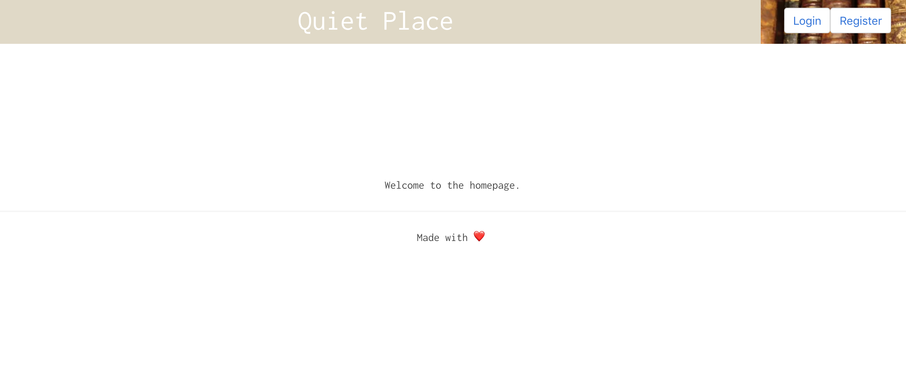
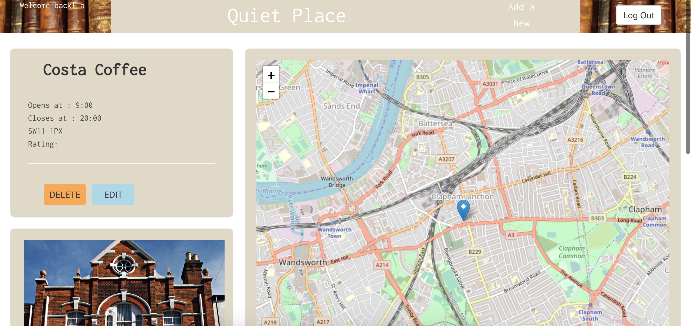
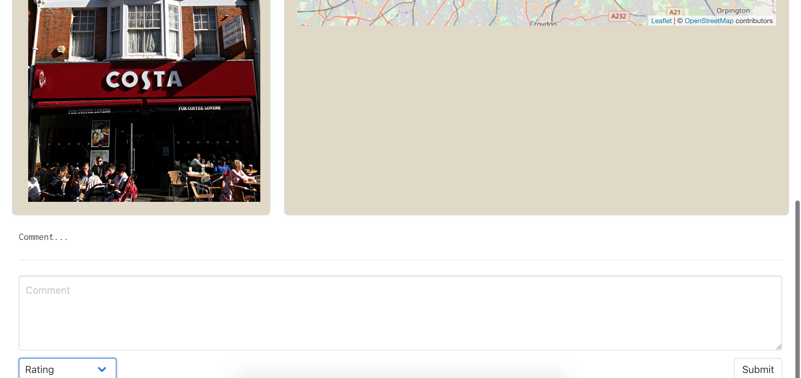
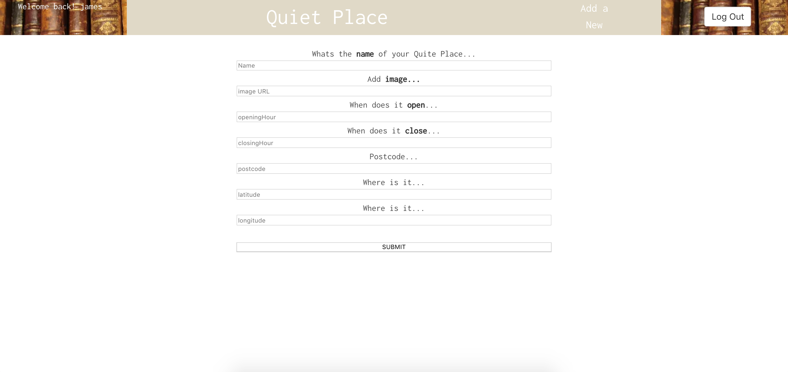
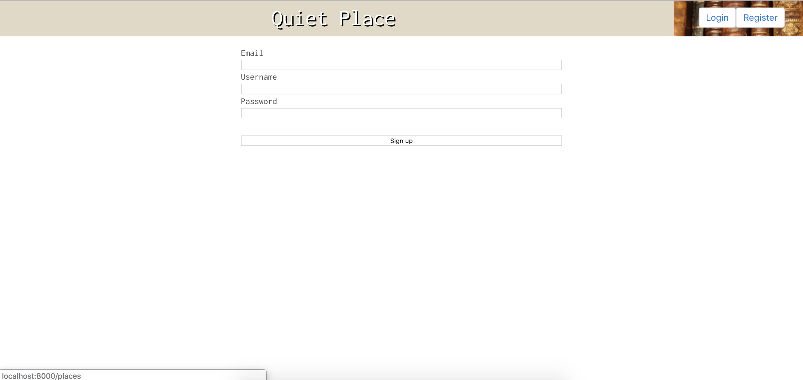
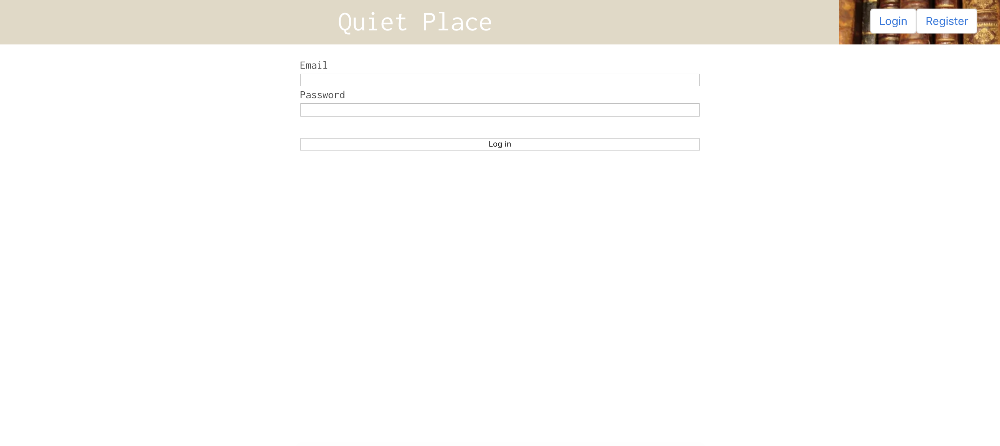
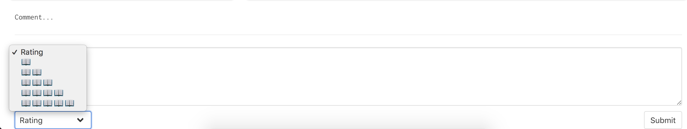

# wdi-project-four || A Quite Place

## Brief

Make a fully functional full-stack application, with a couple models. I decided to build an application that allowed users to recommended quite places to working, with a map to show visional where you are and where the closest place to work was.

## Technologies Used

HTML | SCSS | JavaScript (ES6) | MongoDB | Express.js | React | Node.js | Webpack | Mongoose

The app is deployed on Heroku.

## Wireframes


## THE APP

The user is first shown a map, with markers . Each marker is a 'quite place' which is added and rated by users, you can only do this when you are logged in in. The whole app is minimal, trying to be a simplistic as possible. The main feature is a switch which changes the page to from a Map box to a Index page with picture and rating of each place.

Once logged in, the user can also comment on each quite place. If the user adds a rating (1-5) the average of all ratings will be show on the index page.







### Forms (login, register, add new)







### Examples of Code / Challenges

#### mapMode:

When the Index page is first renders I set the state of mapMode to true.
```
this.state = {
    places: null,
    userPosition: null,
    mapMode: true
  };
```
So whenever the page loads it will always show the map first. When the button is clicked it invoked the toggleMapMode, which changes mapMode to false and renders the photo index page.


```
toggleMapMode() {
  const newMode = !this.state.mapMode;
  this.setState({ mapMode: newMode });
}
```

Depending what this.state.mapMode is set to, will also determine what text appears on the button.

```
{
  (this.state.mapMode)
    ?
    <button className="toggleButton column is-2" onClick={this.toggleMapMode}>SWITCH TO: PLACES</button>
    :
    <button className="toggleButton column is-2" onClick={this.toggleMapMode}>SWITCH TO: MAP</button>
}
```

#### Ratings:

First I need to add a average rating virtual to my place model, to show the overall ratings on the index page.

```
placeSchema.virtual('avgRating')
  .get(function() {
    return Math.round(this.comments.reduce((sum, comment) => {
      return sum + comment.rating;
    }, 0) / this.comments.length);
  });
  ```

Next, I would need users to submit there
ratings. So within the CommentForm, I added a select tags with option tags its child.

```
<div className="select">
  <select id="rating" name="rating" onChange={handleChange} value={comment.rating || ''}>
    <option value="">Rating</option>
    <option value="1">📖</option>
    <option value="2">📖📖</option>
    <option value="3">📖📖📖</option>
    <option value="4">📖📖📖📖</option>
    <option value="5">📖📖📖📖📖</option>
  </select>
</div>
```

The ratings are in the same form as the comments, so when a user comments, they can add a ratings as well.



#### Known Bugs 🐛 and Wins

The search bar doesn't work, it has no function. 

Overall the app is pretty smooth and I felt that I managed my time very well during this project. reaching MVP pretty quickly and then was able to try new thing. My main win was the map.

#### Future Additions

##### API
I had trouble finding an appropriate API, it became to time consuming so I decided to hard code my data. I would needed a couple API's, mainly a public libraries in London one.

##### Flash Messages
Adding flash message for when users log in, log out and add place or comments.

#### Search Bar

A working search bar, which can search by key word. For example, street name or postcode.
